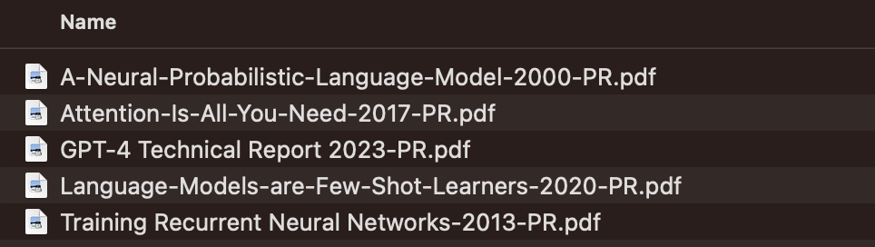

# pdfrename - *say goodbye to `ed1d47.pdf`!*

A simple python script to **rename *research PDF* files based on their content**.

Leverages [pdfminer](https://github.com/pdfminer/pdfminer.six) to extract text and [GPT](https://openai.com) to generate the filename.

### Before


### After running pdfrename



## FAQ

*Why not use the Title from the PDF metadata? Because it's often missing: in my personal collection of research papers, only 44% of the PDFs have a Title metadata field.*

*Isn't this expensive? In my personal collection of research papers, renaming each PDF uses ~2.1K tokens on average. At `gpt-4o-mini` current cost of $0.15 / 1M input tokens, that means renaming each PDF costs ~$0.000315 (less than 1 tenth of a penny). I think it's worth it!*

*Why does it add -PR.pdf to the end of filenames? Since the cost is non-zero to rename files, pdfrename needs to keep track of files which have already been renamed to avoid renaming again. I wanted something simpler than having to store a db, using filesystem attributes, or storing additional metadata files. I settled on using this suffix (-PR for (P)DF (R)ename) as a marker for renamed files.*

## Multi-language Support

pdfrename now supports multiple languages! The script automatically detects the language of the extracted text and adjusts the prompt accordingly. This allows for accurate filename generation in various languages.

## Usage

Set your OpenAI API key in the ENV variable:
```bash
export OPENAI_API_KEY=YOURSECRETAPIKEY
```

Then run:

```bash
pip install -r requirements.txt
python pdfrename.py filetorename.pdf
```

To run recursively on a directory:

```bash
find PATHTOFOLDER -name "*.pdf" -not -name "*-PR.pdf" | parallel -j 4 python pdfrename.py
```

To automate this, consider creating a cron job or using a tool like [watchman](https://facebook.github.io/watchman/) to watch for changes and run *pdfrename* automatically.

